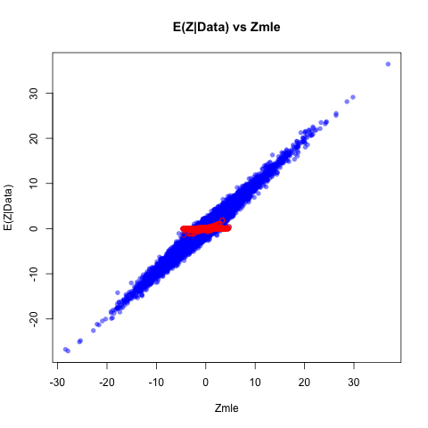
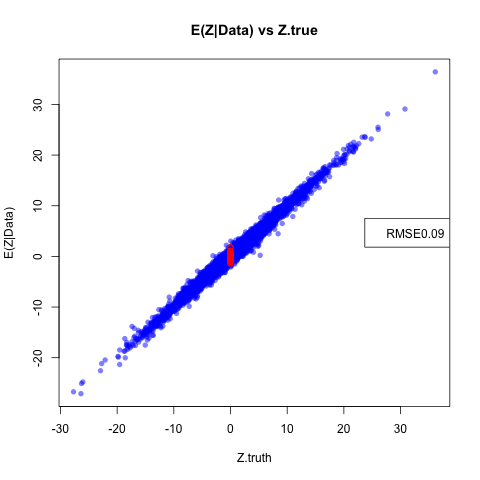
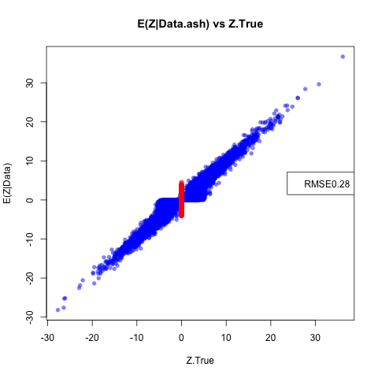

 The purpose is to simulate according to the factor model, where 100 snps in cis of a gene, $pi0$ is 0.80, and there is sharing according to gtex covmats 2:9.
 
```{r setup, include=FALSE}
knitr::opts_chunk$set(cache=TRUE)
source("~/matrix_ash/R/main.R")
```

```{r simulatedata, eval=FALSE}
source("~/matrix_ash/R/main.R")
source("~/matrix_ash/R/NewSimulations.R")
data=factor_sim_new(J = 50000)##simulate 50000 gene snp pairs
t=data$tstat;bhat=data$betahat;sebetahat=data$sebetahat;beta=data$beta
saveRDS(data,"~/Dropbox/simdata.rds")
c=apply(t,1,function(x){max(abs(x))})
maxes=order(c,decreasing = TRUE)[1:400]##take top 100 gene snp pairs
max.t=t[maxes,]
##sfa -gen ./maxt.txt -g 400 -n 44 -o tri_sim_strongt i -k 5

factor.mat=as.matrix(read.table("~/Dropbox/tri_sim_strongt_F.out"))
lambda.mat=as.matrix(read.table("~/Dropbox/tri_sim_strongt_lambda.out"))
v.j=matrix(rep(1,ncol(t)*nrow(t)),ncol=ncol(t),nrow=nrow(t))
covmat=compute.covmat(b.gp.hat = t,sebetahat = v.j,Q =5, t.stat=max.t,lambda.mat=lambda.mat,P=3,A="testim", factor.mat = factor.mat,bma = FALSE)
```

Now, let's fit the model using the random set of 20,000 gene snp pairs.

```{r, eval=FALSE}

compute.hm.train(train.b = t[1:20000,],se.train = v.j[1:20000,],covmat = covmat,A="Simulations")

```

Now, we can compute posteriors for, say, the first 10000 gene snp pairs:

```{r computeposteriors,eval=FALSE}
A="Simulations"
pis=readRDS(paste0("pis",A,".rds"))$pihat
b.test=t[1:10000,]
se.test=v.j[1:10000,]
weightedquants=lapply(seq(1:10000),function(j){total.quant.per.snp(j,covmat,b.gp.hat=b.test,se.gp.hat = se.test,pis,A="Simulations",checkpoint = FALSE)})
```

We can compute the root mean squared error:
```{r RMSE}
data=readRDS("~/Dropbox/simdata.rds")
t=data$tstat;bhat=data$betahat;sebetahat=data$sebetahat;beta=data$beta;v.j=matrix(rep(1,ncol(t)*nrow(t)),ncol=ncol(t),nrow=nrow(t))
covmat=readRDS("~/Dropbox/covmattestim.rds")

t.truth.test=beta/sebetahat
post.means=read.table("~/Dropbox/Simulationsposterior.means.txt")[,-1]
sqrt(mean((t.truth.test[1:10000,]-post.means)^2))
```


Let's check some stuff out:

```{r checkpoint}
j=sample.int(100,1)

all.arrays=post.array.per.snp(j=j,covmat = covmat,b.gp.hat = t,se.gp.hat = v.j)

b.mle=as.vector(t(t[j,]))##turn i into a R x 1 vector
V.gp.hat=diag(v.j[j,])^2
V.gp.hat.inv <- solve(V.gp.hat)
k=17

U.gp1kl <- (post.b.gpkl.cov(V.gp.hat.inv, covmat[[k]]))
mu.gp1kl <- as.array(post.b.gpkl.mean(b.mle, V.gp.hat.inv, U.gp1kl))
#(all.arrays$post.means[k,])
plot(all.arrays$post.means[k,],mu.gp1kl)

##Now, check to make sure weighting is correct
post.means=as.matrix(read.table("~/Dropbox/Simulationsposterior.means.txt")[,-1])
post.weights=as.matrix(read.table("~/Dropbox/Simulationspost.weights.txt")[,-1])

plot(post.means[j,],post.weights[j,]%*%all.arrays$post.means)
#(post.means[j,])
#(post.weights[j,]%*%all.arrays$post.means)

```
Now let's compare this to univariate ash measures:
```{r univariateash,eval=FALSE}
train.z=t[1:20000,]
train.v=v.j[1:20000,]

z.stat=b.test
v.j=se.test

univariate.ash.pm=matrix(nrow=nrow(z.stat),ncol=ncol(z.stat))
univariate.ash.lfsr=matrix(nrow=nrow(z.stat),ncol=ncol(z.stat))

R=ncol(z.stat)

for(x in 1:R){

b=ash(betahat=train.z[,x],sebetahat=train.v[,x],mixcompdist="normal")##fit weights on random data
g.fix=b$fitted.g
max.z.fit=ash(betahat=z.stat[,x], sebetahat=v.j[,x],g=g.fix,control=list(maxiter=0))
univariate.ash.pm[,x]=max.z.fit$PosteriorMean
univariate.ash.lfsr[,x]=max.z.fit$lfsr
}

write.table(univariate.ash.pm,file="univariate.ash.pm.txt")
write.table(univariate.ash.lfsr,file="univariate.ash.lfsr.txt")
```

Let's compare the RMSE here:

```{r univariateashcompare}
univariate.ash.pm=read.table("~/Dropbox/univariate.ash.pm.txt")

sqrt(mean((t.truth.test[1:10000,]-univariate.ash.pm)^2))
```

We can also plot the scatterplot to observe the behavior of 'null' and 'real' associations:

```{r scatterplot,eval=FALSE, echo=FALSE}

nulls=which(data$beta[,1]=="0",)
null.vals=intersect(1:nrow(post.means),nulls)


png("scatterplot.fitted.png")
plot(as.matrix(t[1:10000,]),as.matrix(post.means),col=adjustcolor("blue", alpha=0.5), pch=16,main="E(Z|Data) vs Zmle",ylab="E(Z|Data)",xlab="Zmle")
points(t[null.vals,],post.means[null.vals,],col="red")
dev.off()


png("scatterplot.truth.png")
plot(as.matrix(t.truth.test[1:10000,]),as.matrix(post.means),col=adjustcolor("blue", alpha=0.5), pch=16,main="E(Z|Data) vs Z.true",ylab="E(Z|Data)",xlab="Z.truth")
points(t.truth.test[null.vals,],post.means[null.vals,],col="red")
legend("right",legend=paste0("RMSE",round(sqrt(mean((t.truth.test[1:10000,]-post.means)^2)),2)))

dev.off()


png("scatterplot.TRUTH.ash.png")
plot(as.matrix(t.truth.test[1:10000,]),as.matrix(univariate.ash.pm),col=adjustcolor("blue", alpha=0.5), pch=16,main="E(Z|Data.ash) vs Z.True",ylab="E(Z|Data)",xlab="Z.True")
points(t.truth.test[null.vals,],univariate.ash.pm[null.vals,],col="red")
legend("right",legend=paste0("RMSE",round(sqrt(mean((t.truth.test[1:10000,]-univariate.ash.pm)^2)),2)))
dev.off()

```

 



