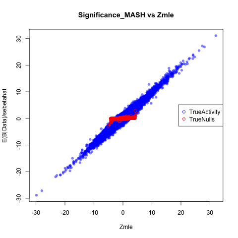
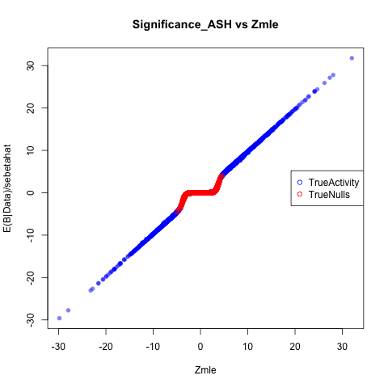
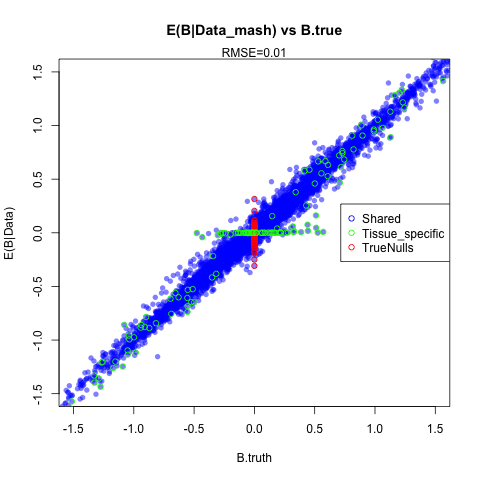
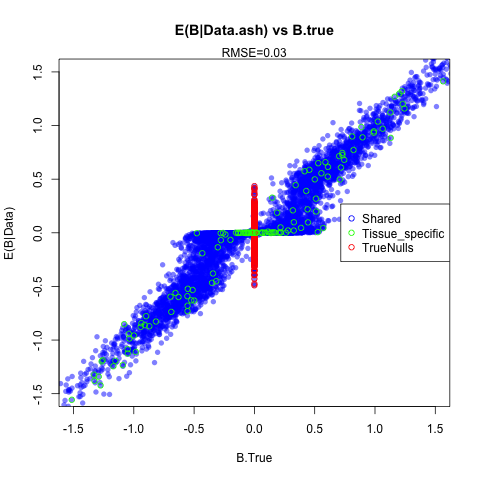

The purpose is to simulate according to the patterns of sharing present in the GTEX V6 Data, where 100 snps in cis of 500 genes, $pi0$ is 0.80, and there is sharing according to gtex covmats 2:9 and about 35% tissues specific. Thus the componenet ID for the $'tissue specific QTL'$ will be $SimulatedComponenet=9:13$.


```{r setup, include=FALSE}
knitr::opts_chunk$set(cache=TRUE)
```

First, install, the package. I've already done this:
```{r,echo=TRUE,eval=FALSE}
devtools::install_github("surbut/matrix_ash")
library("mash")
library("bigmemory")
library("SQUAREM")
library("mvtnorm")
```

```{r simulatedata, eval=FALSE}

library("mvtnorm")
data=factor_sim_new(J = 50000,tspec=5)##simulate 50000 gene snp pairs, with 5 tissue specific tissues
saveRDS(data,"~/Dropbox/simdata_tspec.rds")
c=apply(t,1,function(x){max(abs(x))})
maxes=order(c,decreasing = TRUE)[1:400]##take top 100 gene snp pairs
max.t=t[maxes,]
##sfa -gen ./maxt.txt -g 400 -n 44 -o tri_sim_strongt i -k 5

factor.mat=as.matrix(read.table("~/Dropbox/tri_sim_spect_F.out"))
lambda.mat=as.matrix(read.table("~/Dropbox/tri_sim_spect_lambda.out"))
s.j=matrix(rep(1,ncol(t)*nrow(t)),ncol=ncol(t),nrow=nrow(t))
v.j=s.j^2
covmat=compute.covmat(b.gp.hat = t,sebetahat = s.j,Q =5, t.stat=max.t,lambda.mat=lambda.mat,P=3,A="testim_tspec_new", factor.mat = factor.mat,bma = TRUE)##Note that here, we perform our inference including the BMA configs.
```

To determine how much is tissue specific:
```{r definedata,eval=TRUE}
library("mash")
data=readRDS("~/Dropbox/simdata_tspec.rds")
t=data$tstat;bhat=data$betahat;sebetahat=data$sebetahat;beta=data$beta
sum(data$component.id>8)/length(data$component.id)
```

Here, we can see that `r sum(data$component.id>8)/length(data$component.id)` is tissue specific, and the tissue specific tissues are:
```{r whichspec}
lapply((data$component.mats[9:13]),function(x){which(diag(x)!=0)})
```
We can find which pairs have tissue specific activity and plot an example of their t statistic, to make sure the model is simulating correctly:
```{r plotsample}

(j=which(data$component.id==9)[1])
```
This corresponds to tissue specificity in:
```{r tissuespectissue}
diag(data$component.mats[[9]])
which(diag(data$component.mats[[9]])!=0)
```

Accordingly, a plot of gene-snp pair `r j` t-statistics should show tissue specificity tissue `r which(diag(data$component.mats[[9]])!=0)`:
```{r}

barplot(data$tstat[j,],names=seq(1,44),las=3,xlab="Tissue",ylab="Tstatistic",main=paste(c("Individual",j,"T stats")))
```

Now, let's fit the model using the random set of 20,000 gene snp pairs. We computed the covariance matrix above, using the strongest 500 gene snp pairs to estimate the strong 'patterns' of sharing, and building a KxL list that incorporated $\omega$ according to the magntiude of the effect size present in the overall data.

```{r, eval=FALSE}
covmat=readRDS("~/Dropbox/covmattestim_tspec.rds")
compute.hm.train(train.b = t[1:20000,],se.train = s.j[1:20000,],covmat = covmat,A="testtissuespec")
#compute.hm.train.log.lik for numerical issues

```

Now, we can compute posteriors for, say, the first 10000 gene snp pairs:

```{r computeposteriors,eval=FALSE}
A="testtissuespec"
pis=readRDS(paste0("pis",A,".rds"))$pihat
b.test=t[1:10000,]
se.test=s.j[1:10000,]
weightedquants=lapply(seq(1:10000),function(j){total.quant.per.snp(j,covmat,b.gp.hat=b.test,se.gp.hat = se.test,pis,A="testtissuespec",checkpoint = FALSE)})
```

Let's check some stuff out:

```{r checkpoint,eval=FALSE}
j=sample.int(100,1)

all.arrays=post.array.per.snp(j=j,covmat = covmat,b.gp.hat = t,se.gp.hat = v.j)

b.mle=as.vector(t(t[j,]))##turn i into a R x 1 vector
V.gp.hat=diag(s.j[j,])^2
V.gp.hat.inv <- solve(V.gp.hat)
k=3

U.gp1kl <- (post.b.gpkl.cov(V.gp.hat.inv, covmat[[k]]))
mu.gp1kl <- as.array(post.b.gpkl.mean(b.mle, V.gp.hat.inv, U.gp1kl))
#(all.arrays$post.means[k,])
plot(all.arrays$post.means[k,],mu.gp1kl)

##Now, check to make sure weighting is correct
post.means=as.matrix(read.table("~/Dropbox/testtissuespecposterior.means.txt")[,-1])
lik.snp=lik.func(b.mle,V.gp.hat,covmat)
post.weights=t(lik.snp*pis/sum(lik.snp*pis))

plot(post.means[j,],post.weights%*%all.arrays$post.means)
#(post.means[j,])
#(post.weights[j,]%*%all.arrays$post.means)

```
Now let's compare this to univariate ash measures:
```{r univariateash,eval=FALSE}
train.z=t[1:20000,]
train.v=s.j[1:20000,]

z.stat=b.test
v.j=se.test

univariate.ash.pm=matrix(nrow=nrow(z.stat),ncol=ncol(z.stat))
univariate.ash.lfsr=matrix(nrow=nrow(z.stat),ncol=ncol(z.stat))

R=ncol(z.stat)

for(x in 1:R){

b=ash(betahat=train.z[,x],sebetahat=train.v[,x],mixcompdist="normal")##fit weights on random data
g.fix=b$fitted.g
max.z.fit=ash(betahat=z.stat[,x], sebetahat=v.j[,x],g=g.fix,control=list(maxiter=0))
univariate.ash.pm[,x]=max.z.fit$PosteriorMean
univariate.ash.lfsr[,x]=max.z.fit$lfsr
}

write.table(univariate.ash.pm,file="univariate.ash.pm.tspec.txt")
write.table(univariate.ash.lfsr,file="univariate.ash.lfsr.tspec.txt")
```

Let's compare the RMSE here using all three methods. We want to compute the mean squared error of the effec, so we multiply by the standard error.

```{r univariateashcompare}
data=readRDS("~/Dropbox/simdata_tspec.rds")
t=data$tstat;bhat=data$betahat;sebetahat=data$sebetahat;beta=data$beta;v.j=matrix(rep(1,ncol(t)*nrow(t)),ncol=ncol(t),nrow=nrow(t))
t.truth.test=beta/sebetahat
mash.means=read.table("~/Dropbox/testtissuespecposterior.means.txt")[,-1]
univariate.ash.pm=read.table("~/Dropbox/univariate.ash.pm.tspec.txt")
bma.pm=read.table("~/Dropbox/testimBMAonly_tspecposterior.means.txt")[,-1]


sqrt(mean((beta[1:10000,]-mash.means*sebetahat)^2))
sqrt(mean((beta[1:10000,]-univariate.ash.pm*sebetahat)^2))
sqrt(mean((beta[1:10000,]-bma.pm*sebetahat)^2))
```

We can also plot the scatterplot to observe the behavior of 'null'(in red) and 'real'(in blue) associations. We see that our joint analysis reduces the Root Mean Squared Error (RMSE) and provides ample shrinkage of 'null values'.

```{r scatterplot,eval=FALSE, echo=FALSE}

nulls=which(rowSums(data$beta)==0,)
null.vals=intersect(1:nrow(post.means),nulls)
tspec=which((data$component.id>8))
tissues=apply(t.truth.test[tspec,],1,function(x){
  which(x!=0)
})

tspecific=cbind(tspec,tissues)


post.means=as.matrix(post.means)

png("~/matrix_ash/Vignettes/Figures/scatterplot.fittedtspec.png")
plot(as.matrix(t[1:10000,]),as.matrix(post.means),col=adjustcolor("blue", alpha=0.5), pch=16,main="E(Z|Data) vs Zmle",ylab="E(Z|Data)",xlab="Zmle")
points(t[null.vals,],post.means[null.vals,],col="red")
points(t[tspecific],post.means[tspecific],col="green")
dev.off()

png("~/matrix_ash/Vignettes/Figures/scatterplot.fittedtspec.ash.png")
plot(as.matrix(t[1:10000,]),as.matrix(univariate.ash.pm),col=adjustcolor("blue", alpha=0.5), pch=16,main="E(Z|Data_ash) vs Zmle",ylab="E(Z|Data_ash)",xlab="Zmle")
points(t[null.vals,],univariate.ash.pm[null.vals,],col="red")
points(t[tspecific],univariate.ash.pm[tspecific],col="green")
dev.off()


png("~/matrix_ash/Vignettes/Figures/scatterplot.truthtspec.png")
plot(as.matrix(t.truth.test[1:10000,]),as.matrix(post.means),col=adjustcolor("blue", alpha=0.5), pch=16,main="E(Z|Data) vs Z.true",ylab="E(Z|Data)",xlab="Z.truth")
points(t.truth.test[null.vals,],post.means[null.vals,],col="red")
points(t.truth.test[tspecific],post.means[tspecific],col="green")
legend("right",legend=c(paste0("RMSE=",round(sqrt(mean((t.truth.test[1:10000,]-post.means)^2)),2)),"Tissue_specific","TrueNulls"),pch=1,col=c("black","green","red"))
dev.off()


png("~/matrix_ash/Vignettes/Figures/scatterplot.TRUTHashtspec.png")
plot(as.matrix(t.truth.test[1:10000,]),as.matrix(univariate.ash.pm),col=adjustcolor("blue", alpha=0.5), pch=16,main="E(Z|Data.ash) vs Z.True",ylab="E(Z|Data)",xlab="Z.True")
points(t.truth.test[null.vals,],univariate.ash.pm[null.vals,],col="red")
points(t.truth.test[tspecific],univariate.ash.pm[tspecific],col="green")
legend("right",legend=c(paste0("RMSE=",round(sqrt(mean((t.truth.test[1:10000,]-univariate.ash.pm)^2)),2)),"Tissue_specific","TrueNulls"),pch=1,col=c("black","green","red"))
dev.off()

```


 





And here we plot number sig vs significance threshold:
```{r echo=FALSE,cache=TRUE}
lfsr.bma=read.table("~/Dropbox/testimBMAonly_tspeclfsr.txt")[,-1]
lfsr.mash=read.table("~/Dropbox/testtissuespeclfsr.txt")[,-1]
lfsr.ash=read.table("~/Dropbox/univariate.ash.lfsr.tspec.txt")


beta=as.matrix(beta[1:10000,])
lfsr.mash=as.matrix(lfsr.mash)
lfsr.ash=as.matrix(lfsr.ash)
lfsr.bma=as.matrix(lfsr.bma)


sig_func=function(beta,lfsr,thresh){
sapply(seq(1:nrow(beta)),function(x){
  nonzero=which(beta[x,]!=0)
  sigs=which(lfsr[x,]<thresh)
  length(intersect(sigs,nonzero))
})
}


# mash.sigs=sig_func(beta,lfsr.mash,thresh=0.10)
# ash.sigs=sig_func(beta,lfsr.ash,thresh=0.10)
# bma.sigs=sig_func(beta,lfsr.bma,thresh=0.10)


plot(0.05,sum(sum(beta!=0&lfsr.mash<0.05)),col="blue",ylim=c(0,10000),xlim=c(0.01,0.10),pch=2,ylab="NumberofTrueAssociationsCaptured",xlab="LFSRThreshold")

for(thresh in seq(from = 0.01,to = 0.1,by = 0.001)){
points(thresh,sum(beta!=0&lfsr.mash<thresh),col="blue",pch=1)}
for(thresh in seq(from = 0.01,to = 0.1,by = 0.001)){
points(thresh,sum(beta!=0&lfsr.bma<thresh),col="red",pch=2)}
for(thresh in seq(from = 0.01,to = 0.1,by = 0.001)){
points(thresh,sum(beta!=0&lfsr.ash<thresh),col="green",pch=3)}

legend("bottom",legend=c("MASH","BMALite","ASH"),pch=c(2,1,3),col=c("blue","red","green"))
title("Number of True Association Captured vs Significance (LFSR) Threshold, with TS")
```
